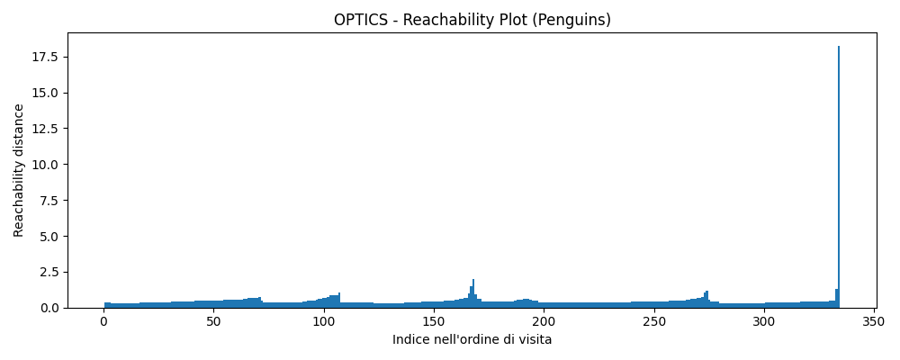
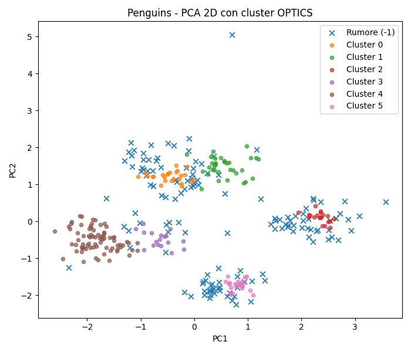
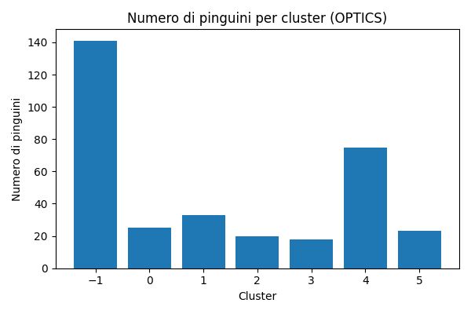
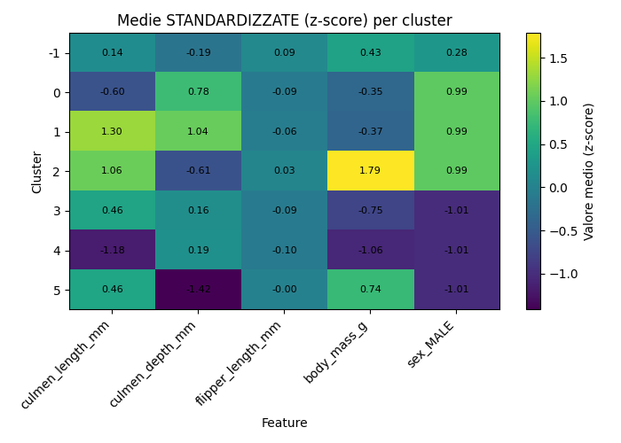
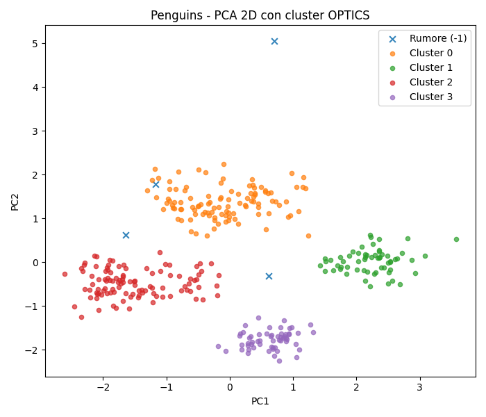

# Applicazione di OPTICS – Dataset “Penguins” #

L'obiettivo di questa parte pratica è vedeere come OPTICS si comporta su un dataset reale con poche dimensioni e struttura a cluster e, allo stesso tempo, capire se nei dati dei pinguini emergono davvero gruppi di individui con caratteristiche simili (ad esempio per dimensioni, massa corporea e sesso).
L’algoritmo è stato implementato in Python, utilizzando le principali librerie per l’analisi dei dati e il machine learning.

---

### **1. SETTING DELL'AMBIENTE** ###
Per prima cosa sono state importate tutte le librerie necessarie al funzionamento del programma:

```
import pandas as pd
import numpy as np
import matplotlib.pyplot as plt #per i grafici
 
from sklearn.preprocessing import StandardScaler #per la standardizzazione delle feature
from sklearn.cluster import OPTICS #algoritmo di clustering
from sklearn.decomposition import PCA #per la riduzione della dimensionalità
 ```
Il dataset è stato caricato da file CSV in un DataFrame pandas e ne è stata effettuata una prima ispezione:

```
df = pd.read_csv(file_path) 
print(df.head())
print(df.info())
```
L’output mostra le prime righe e alcune informazioni strutturali:
- 344 righe totali
- 5 colonne:
  * ```culmen_length_mm```, ```culmen_depth_mm``` , ```flipper_length_mm``` , ```body_mass_g``` (di tipo float64)
  * ```sex``` (di tipo object)

Viene inoltre evidenziata la presenza di valori mancanti.

---

### **2. PREPROCESSING DEI DATI** ###
Prima di poter applicare l’algoritmo è stato necessario ripulire e trasformare i dati.


#### **RIMOZIONE DEI VALORI MANCANTI** ####

```
df = df.dropna()
```
 
Si eliminano le righe contenenti almeno un valore mancante; questo riduce leggermente il numero di pinguini ma garantisce che l’algoritmo lavori su un dataset completo.


#### **CODIFICA DELLA VARIABILE CATEGORICA ```sex```** ####

OPTICS richiede esclusivamente feature numeriche. La variabile sex è stata trasformata in una variabile binaria:

```
df = pd.get_dummies(df, columns=["sex"], drop_first=True)  
print(df.head())
``` 
L’opzione ```drop_first=True``` evita la collinearità: invece di creare due colonne (```sex_FEMALE```, ```sex_MALE```) ridondanti, viene mantenuta solo ```sex_MALE``` (0 = femmina, 1= maschio)

Le prime righe risultano, ad esempio:
```
    culmen_length   culmen_depth    flipper_length  	body_mass  sex_MALE
0          	39.1         	18.7          	181.0   	3750.0     	1
1          	39.5         	17.4          	186.0   	3800.0    	0
2          	40.3         	18.0          	195.0   	3250.0    	0
4          	36.7         	19.3          	193.0   	3450.0    	0
5          	39.3         	20.6          	190.0   	3650.0   	1
```
---
 
### **3 – SELEZIONE DELLE FEATURE** ###
 
Sono state selezionate tutte le feature disponibili per il clustering:

-   ```culmen_length_mm``` -> Lunghezza del becco
-   ```culmen_depth_mm``` -> Profondità del becco
-   ```flipper_length_mm``` -> Lunghezza della pinna
-   ```body_mass_g``` -> Massa corporea
-   ```sex_MALE``` -> Sesso
     
``` 
features = [
    "culmen_length_mm",
    "culmen_depth_mm",
    "flipper_length_mm",
    "body_mass_g",
	“sex_male” #flag che indica il sesso
]
 
X = df[features].values
```
```X``` è quindi una matrice di dimensione (*n_pinguini, 5*)

---

### **4 – STANDARDIZZAZIONE DELLE FEATURE** ###
 
Le variabili presentano scale molto diverse (millimetri, grammi, variabile binaria) che non sarebbero paragonabili. Poiché OPTICS si basa sulle distanze, è necessario riportarle su una scala comparabile tramite standardizzazione:
 
```
scaler = StandardScaler()
X_scaled = scaler.fit_transform(X) #applica ad ogni colonna una formula 
 
 
print("Shape X_scaled:", X_scaled.shape) 
print("Prima riga:", X_scaled[0]) 
```

L’output conferma che:

* ```X_scale```d ha dimensione (335, 5)

* ogni riga rappresenta un pinguino in uno spazio a 5 dimensioni standardizzato, ad esempio:

```Prima riga: [-0.89772327  0.77726336 -0.12689335 -0.57223347  0.99108452]```

---

### **5 – APPLICAZIONE DI OPTICS** ###
 
L’algoritmo OPTICS è stato applicato a X_scaled con i seguenti parametri:

* ```min_samples = 10``` -> numero minimo di punti nel vicinato di un punto perché questo sia considerato core point;
* ```xi = 0.05``` -> controlla la sensibilità alle variazioni di densità: valori più piccoli rendono OPTICS più sensibile a cambiamenti locali e tendono a produrre più cluster;
* ```min_cluster_size = 0.05``` -> dimensione minima del cluster pari al 5% del numero totale di punti.

```
optics = OPTICS(
	min_samples=10,
	xi=0.05,    
	min_cluster_size=0.05
)
 
optics.fit(X_scaled)
```
 
Dopo il fit vengono estratte le etichette di cluster:

```
labels = optics.labels_ #array delle etichette dei cluster 
unique, counts = np.unique(labels, return_counts=True) 
 
print("Label uniche:", unique)
print("Distribuzione:", dict(zip(unique, counts)))
``` 
Le etichette hanno il seguente significato:
* ```-1```  -> punti considerati rumore (outlier)
* ```0, 1, 2 … ```-> cluster individuati dall’algoritmo

Nell’esperimento con tutte le feature (incluso ```sex_MALE```) OPTICS ha individuato 6 cluster (0-5) più una quota di rumore (-1). La distribuzione è, ad esempio:

```
Label uniche: [-1  0  1  2  3  4  5]
Distribuzione: {
  -1: 141,
   0: 25,
   1: 33,
   2: 20,
   3: 18,
   4: 75,
   5: 23
}
```
(la somma corrisponde ai 335 pinguini rimasti dopo il preprocessing).

---

### **6 - COSTRUZIONE DEL REACHABILITY PLOT** ###

Per interpretare il risultato di OPTICS è stato costruito il reachability plot, che rappresenta la reachability distance dei punti nell’ordine in cui vengono visitati dall’algoritmo.

```
ordering = optics.ordering_ 
reachability = optics.reachability_[ordering] 


#Grafico del reachability plot
plt.figure(figsize=(10, 4))
plt.title("OPTICS - Reachability Plot (Penguins)")
plt.xlabel("Indice nell'ordine di visita")
plt.ylabel("Reachability distance")
plt.bar(np.arange(len(reachability)), reachability, width=1.0)
plt.tight_layout()
plt.show()
```

* ```ordering``` è la permutazione degli indici dei pinguini secondo l’ordine di visita di OPTICS (guidato dalla densità, non dall’ordine originario del dataset)
* ```reachability``` contiene, per ciascun punto in questo ordine, la sua reachability distance.

Nel grafico risultante si osservano:

* “vallate” a bassa reachability distance -> regioni dense dello spazio dei dati, corrispondenti ai cluster;

* picchi più elevati -> punti isolati o transizioni tra cluster, spesso associati a rumore.



---

### **7 - VISUALIZZAZIONE DEI CLUSTER TRAMITE PCA 2D** ###

Per verificare i cluster è stata applicata la PCA (Principal Component Analysis) per ridurre lo spazio da 5 a 2 dimensioni:

```
pca = PCA(n_components=2) #riduzione a 2 dimensioni
X_pca = pca.fit_transform(X_scaled)
```
Le due componenti principali (PC1, PC2) spiegano una frazione consistente della varianza totale. I punti sono stati proiettati nel piano PC1 - PC2 e colorati in base all’etichetta di cluster:
```
plt.figure(figsize=(7, 6))
plt.title("Penguins - PCA 2D con cluster OPTICS")
plt.xlabel("PC1")
plt.ylabel("PC2")

for cluster_id in np.unique(labels):
    mask = labels == cluster_id
    if cluster_id == -1:    #rumore
        lab = "Rumore (-1)"
        marker = "x"
        size = 40
        alpha = 0.9
    else:
        lab = f"Cluster {cluster_id}" #etichetta del cluster
        marker = "o"
        size = 20
        alpha = 0.7
    
    # Scatter plot dei punti appartenenti al cluster corrente
    plt.scatter(
        X_pca[mask, 0],
        X_pca[mask, 1],
        s=size,
        marker=marker,
        alpha=alpha,
        label=lab
    )

plt.legend()
plt.tight_layout()
plt.show()
```

Nel grafico:
i punti appartenenti allo stesso cluster tendono a formare gruppi compatti e ragionevolmente separati

il rumore (label = -1) appare più disperso, spesso ai margini delle regioni occupate dai cluster



---

### **8 - RISULTATI** ###
Per sintetizzare il risultato è stato creato un DataFrame esteso con l’assegnazione di cluster:
```
df_clusters = df.copy()
df_clusters["cluster"] = labels

print("\nDistribuzione dei pinguini per cluster:")
print(df_clusters["cluster"].value_counts().sort_index())

print("\nMedie per cluster:")
print(df_clusters.groupby("cluster")[features].mean())


print("\n fine del programma")
```

La distribuzione dei pinguini per cluster è la seguente:
```
cluster	n_pinguini
-1    		141
 0     		25
 1     		33
 2     		20
 3     		18
 4     		75
 5     		23
```


Le medie di valori per cluster sono le seguenti:

```
cluster      culmen_length  culmen_depth     flipper_length 	body_mass   sex_MALE
                                                                          
-1              44.773759        16.804255         237.801418  	4557.446809   0.64539
 0              40.744000        18.708000         191.240000  	3931.000000   1.00000
 1              51.066667        19.209091         199.606061  	3912.878788   1.00000
 2              49.775000        15.960000         223.500000  	5642.500000   1.00000
 3              46.488889        17.483333         191.944444  	3608.333333   0.00000
 4              37.565333        17.549333         187.720000  	3357.666667   0.00000
 5              46.500000        14.378261         213.347826  	4802.173913   0.00000
```
analisi...



---

### **9 - ESPERIMENTO AGGIUNTIVO : RIMOZIONE DELLA FEATURE ```sex_MALE```** ###

Per valutare l’impatto della scelta delle feature, è stato condotto un secondo esperimento eliminando la variabile ```sex_MALE``` e utilizzando soltanto le quattro feature morfologiche:

* ```culmen_length_mm```
* ```culmen_depth_mm```
* ```flipper_length_mm```
* ```body_mass_g```

I parametri di OPTICS sono stati mantenuti invariati (```min_samples = 10```, ```xi = 0.05```, ```min_cluster_size = 0.05```) per rendere il confronto significativo.

In questo scenario:

* la grande maggioranza dei punti viene etichettata come rumore (```label = -1```), con circa 268 osservazioni classificate come outlier;
* solo una piccola parte del dataset viene assegnata a pochi cluster “valide” (ad esempio con etichette ```0```, ```1```, ```2```).

La distribuzione dei pinguini per cluster (esperimento senza sesso) è, ad esempio:
```
cluster   n_pinguini

-1        268
 0         17
 1         30
 2         20
```

Le medie per cluster risultano:
```
cluster     culmen_length  culmen_depth    flipper_length    body_mass
                                                                  
-1              42.639925        17.025373        216.873134  	4183.955224
 0              46.500000        17.600000        191.000000  	3588.235294
 1              50.753333        19.020000        199.000000  	3830.833333
 2              49.775000        15.960000        223.500000  	5642.500000
```
analisi


---
### **Analisi di sensibilità rispetto al parametro ```xi```** ###

Per analizzare il comportamento dell’algoritmo OPTICS su dati reali è stato utilizzato il dataset Penguins, che contiene misure morfologiche di pinguini (lunghezza e profondità del becco, lunghezza della pinna, massa corporea) e il sesso dell’animale.

Per valutare l’effetto dei parametri di OPTICS, è stato eseguito un ulteriore esperimento variando il parametro ```xi```, che controlla quanto l’algoritmo è sensibile a variazioni locali di densità. 

L'esperimento è stato effettuato impostando ```xi``` al valore di 0.15, ciò che ne è risultato è stato:



Distribuzione dei pinguini per cluster:
```
cluster		n_pinguini

-1      	4
 0    		107
 1     		60
 2    		105
 3     		59
```
Medie per cluster:
```
cluster       culmen_length   culmen_depth  	flipper_length  		body_mass  		sex_MALE
                                                                            
-1              43.550000        19.950000        1310.000000  		4062.500000       0.5
 0              43.883178        19.094393         194.990654  		4018.224299       1.0
 1              49.558333        15.691667         221.583333  		5488.750000       1.0
 2              40.054286        17.580000         189.104762  		3411.904762       0.0
 3              45.545763        14.262712         212.779661  		4683.050847       0.0
 ```
Aumentando ```xi``` (riducendo quindi la sensibilità) si osserva che:

* il numero di cluster diminuisce (da 6 cluster + rumore a 4 cluster principali + rumore),
* la quota di punti etichettati come rumore crolla (da 141 a 4 osservazioni),
* i cluster risultano più estesi e compatti nello spazio delle feature.

Nel corrispondente grafico PCA 2D i quattro cluster formano insiemi ben separati, mentre i pochi outlier rimangono isolati. Le medie di ```sex_MALE``` per cluster mostrano ancora una forte separazione tra gruppi di soli maschi (valore medio 1) e gruppi di sole femmine (valore medio 0), indicando che la struttura legata al sesso rimane visibile anche con una scelta di ```xi``` molto meno sensibile. Questo esperimento conferma che:

* OPTICS può passare da una descrizione più fine (molti cluster + più rumore) a una più grossolana (pochi cluster grandi + quasi nessun rumore) semplicemente variando ```xi```
* La scelta di ```xi``` non crea cluster “dal nulla”, ma decide a che livello di dettaglio vogliamo leggere la struttura di densità già presente nei dati

## Osservazione ##
Sono stati effettuati diversi esperimenti variando tutti i parametri dell’algoritmo, prima con modifiche di piccola entità e poi con cambiamenti più marcati rispetto ai valori iniziali. In tutti i casi, la quantità di punti etichettati come rumore è rimasta elevata, a meno di ridurre la sensibilità del metodo fino a valori tali da rendere i dati quasi uniformi.

Questo indica che il problema non dipende tanto dalla scelta dei parametri, quanto dal fatto che i punti del dataset sono effettivamente molto dispersi nello spazio delle feature.

---
Il codice completo utilizzato per l’esperimento è disponibile al seguente link: [penguins_optics.py](penguins_optics.py)

